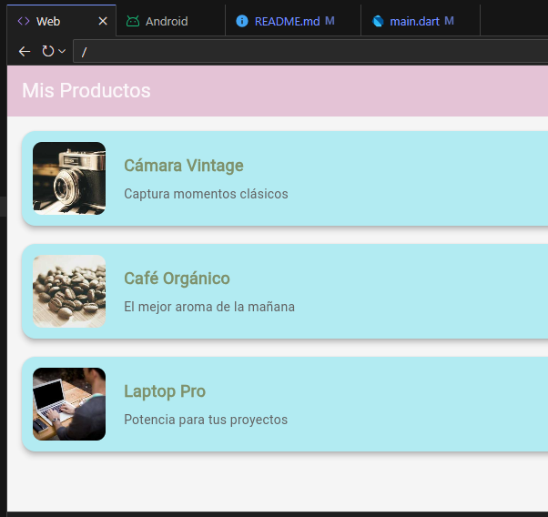

# myapp

### Mi Prompt a IA
Flutter Dart principiante (código completo en un solo archivo). En una columna insertar 3 filas, en cada fila una tarjeta (card). Coloca en cada tarjeta una imagen de la red, a la derecha una columna con 2 filas y en la primera fila un título; en la segunda fila un subtítulo. Añade sombreado a las tarjetas y colores atractivos (pasteles). 
Crear la clase Producto con los atributos: Título, Subtítulo y ImgUrl. Crear también una lista de diccionarios por cada tarjeta.

### Mi Diseño
